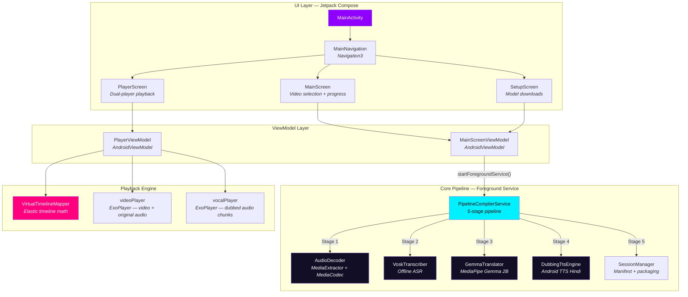

# Nua — Deep Technical Analysis

> **Version**: 2.0 — Full Codebase Audit  
> **Date**: 2026-05-21  
> **Scope**: Architecture, pipeline, playback, build system, security, test coverage, failure modes  
> **Verdict**: The core *idea* is brilliant. The *implementation* has 6 critical bugs, 14 medium-severity defects, and significant architectural gaps — all solvable.

---

## Executive Summary

Nua is an on-device Android application that takes English video lectures and produces Hindi-dubbed versions with synchronized playback — entirely offline. It targets the real educational gap in Indian classrooms where students learn best in Hinglish (Hindi + English technical terms), but content is overwhelmingly in English.

The app's **Dynamic Freeze-Frame Dubbing** architecture is genuinely innovative: instead of expensive on-device video re-encoding, Nua runs two ExoPlayer instances simultaneously — one for video (which can freeze on a frame) and one for dubbed audio chunks — synchronized via a virtual timeline mapper that elastically stretches time when Hindi translations run longer than the original English speech.

**However**, this elegant architecture is undermined by critical implementation defects across every layer: race conditions in the TTS engine, resource leaks in native AI models, a sync loop that causes stuttering and battery drain, thread-safety violations in the UI, a ZIP slip security vulnerability, and near-zero test coverage. Every one of these problems has been solved in other engineering domains, and every one is fixable.

---

## Table of Contents

1. [What The System Is](#1-what-the-system-is)
2. [How It Works — Architecture Deep Dive](#2-how-it-works--architecture-deep-dive)
3. [Where It Works — What's Genuinely Good](#3-where-it-works--whats-genuinely-good)
4. [Where It Fails — Complete Defect Catalog](#4-where-it-fails--complete-defect-catalog)
5. [How It Fails — Failure Mode Analysis](#5-how-it-fails--failure-mode-analysis)
6. [Build System & Dependency Audit](#6-build-system--dependency-audit)
7. [Security & Privacy Audit](#7-security--privacy-audit)
8. [Test Coverage Gap Analysis](#8-test-coverage-gap-analysis)
9. [Cross-Domain Solutions — "Already Solved Elsewhere"](#9-cross-domain-solutions--already-solved-elsewhere)
10. [Prioritized Remediation Roadmap](#10-prioritized-remediation-roadmap)
11. [Appendix: Complete File Inventory](#11-appendix-complete-file-inventory)

---

## 1. What The System Is

### The Problem
Indian classrooms face a content-language mismatch: educational video content (lectures, tutorials, explainers) is predominantly in English, but students learn most effectively when explained in **Hinglish** — a natural blend of Hindi for explanatory language and English for technical/scientific terms (*"Force ka matlab hai ki koi cheez push ya pull karein"*).

### The Solution
Nua is a **local-first, privacy-preserving** Android app that processes English video lectures through a 5-stage on-device AI pipeline:

```
English Video → Audio Extraction → Speech Recognition → Hinglish Translation → Voice Synthesis → Dubbed Playback
```

The key innovation is that **no video re-encoding happens**. Instead, the app produces a lightweight "session package" and uses a dual-player synchronization system during playback to overlay dubbed audio on the original video in real-time.

### The Name
"Nua" means *New* or *Renewed* — fitting for an app that renews educational content in a student's native language.

---

## 2. How It Works — Architecture Deep Dive

### 2.1 System Architecture



### 2.2 Component Inventory

| Layer | Component | File | Lines | Responsibility |
|---|---|---|---|---|
| **UI** | MainActivity | `MainActivity.kt` | 23 | Single-activity entry, edge-to-edge rendering |
| **UI** | Navigation | `Navigation.kt` | 48 | Navigation3 declarative routing between 3 screens |
| **UI** | MainScreen | `MainScreen.kt` | 469 | Video selection (URL/local), compilation progress console, session history gallery |
| **UI** | SetupScreen | `SetupScreen.kt` | 355 | Model download/import, mock mode toggle |
| **UI** | PlayerScreen | `PlayerScreen.kt` | 284 | Dual ExoPlayer rendering, subtitle overlay, seek bar |
| **ViewModel** | MainScreenViewModel | `MainScreenViewModel.kt` | 205 | Compilation orchestration, model management, history |
| **ViewModel** | PlayerViewModel | `PlayerViewModel.kt` | 284 | Dual-player sync loop, freeze-frame coordination |
| **Pipeline** | PipelineCompilerService | `PipelineCompilerService.kt` | 301 | Foreground service, 5-stage pipeline orchestration |
| **Pipeline** | AudioDecoder | `AudioDecoder.kt` | 287 | Video → 16kHz mono WAV (streaming resampler) |
| **Pipeline** | VoskTranscriber | `VoskTranscriber.kt` | 297 | Offline English ASR with word-level timestamps |
| **Pipeline** | GemmaTranslator | `GemmaTranslator.kt` | 220 | On-device English→Hinglish translation (Gemma 2B INT4) |
| **Pipeline** | DubbingTtsEngine | `DubbingTtsEngine.kt` | 197 | Hindi TTS with adaptive speed matching |
| **Playback** | VirtualTimelineMapper | `VirtualTimelineMapper.kt` | 184 | Physical↔virtual timeline offset math |
| **Data** | SessionManager | `SessionManager.kt` | 64 | Session directory management, manifest I/O |
| **Data** | MediaComposition | `MediaComposition.kt` | 21 | Data classes for session manifest (kotlinx.serialization) |
| **Dead Code** | VideoPlayerView | `VideoPlayerView.kt` | 57 | Unused ExoPlayer wrapper with broken DisposableEffect |
| **Dead Code** | DataRepository | `DataRepository.kt` | 13 | Template boilerplate, never called |

### 2.3 The 5-Stage Compilation Pipeline

```
┌─────────────────────────────────────────────────────────────────────┐
│                    PipelineCompilerService                          │
│                   (Android Foreground Service)                      │
│                                                                     │
│  ┌──────────┐    ┌──────────────┐    ┌───────────────┐             │
│  │  Stage 1  │───▶│   Stage 2    │───▶│    Stage 3    │             │
│  │  Audio    │    │     ASR      │    │  Translation  │             │
│  │ Decoder   │    │   (Vosk)     │    │   (Gemma)     │             │
│  └──────────┘    └──────────────┘    └───────┬───────┘             │
│                                               │                     │
│  ┌──────────────────────────────────┐   ┌────▼────────┐            │
│  │           Stage 5                │◀──│   Stage 4   │            │
│  │  Manifest + Session Packaging    │   │  TTS Hindi  │            │
│  └──────────────────────────────────┘   └─────────────┘            │
│                                                                     │
│  Output:  sessions/<id>/                                           │
│           ├── raw_lecture.mp4                                      │
│           ├── manifest.json                                        │
│           └── vocal_chunks/                                        │
│               ├── vocal_0.wav                                      │
│               ├── vocal_1.wav                                      │
│               └── ...                                              │
└─────────────────────────────────────────────────────────────────────┘
```

**Stage 1 — Audio Extraction** (`AudioDecoder.kt`): Uses `MediaExtractor` + `MediaCodec` to decode the video's audio track. Downmixes multi-channel audio to mono via sample averaging. Resamples from source rate to 16kHz using **streaming linear interpolation** with a 16KB rolling write buffer — avoids OOM on long videos. Writes standard PCM WAV with proper header.

**Stage 2 — Speech Recognition** (`VoskTranscriber.kt`): Runs offline ASR using the Vosk small English model (~40MB). Reads the WAV in 4096-byte chunks. Extracts word-level timestamps from Vosk's JSON output. Groups consecutive words into speech segments using a silence-gap heuristic (gap > 0.8s → new segment), with limits on segment duration (7s max) and word count (14 words max).

**Stage 3 — Translation** (`GemmaTranslator.kt`): Uses MediaPipe's LLM Inference API to run Gemma 2B INT4 on-device. Constructs a carefully engineered prompt instructing the model to translate English to Hinglish while preserving scientific terminology in English. Limits output word count based on segment duration (~3.2 words/sec estimation). Passes previous translation for contextual continuity. Includes a comprehensive mock mode with rule-based translation fallback.

**Stage 4 — Voice Synthesis** (`DubbingTtsEngine.kt`): Uses Android's native TTS with Hindi (India) locale. Implements **two-pass adaptive synthesis**: first synthesizes at normal speed, measures the output WAV duration, and if it exceeds the target segment duration, re-synthesizes at a faster rate (capped at 2.0x for intelligibility). Uses `CountDownLatch` to synchronize the async TTS API.

**Stage 5 — Packaging** (`SessionManager.kt`): Writes a `manifest.json` containing segment metadata (timestamps, text, file paths, playback directives) and places all vocal clips in the `vocal_chunks/` subdirectory.

### 2.4 The Dynamic Freeze-Frame Playback System

This is the most innovative part of the system:

```
Physical Video Timeline:  |====A====|----gap----|====B====|----gap----|====C====|
                          0s        3s          5s        8s         10s       13s

Virtual Timeline:         |====A====|==FREEZE==|----gap----|====B====|=FREEZE=|----gap----|====C====|
                          0s        3s    4.5s  5s         7s        9.5s 10.5s 11s        14s

                          ▲ Freeze: video pauses on last frame of segment A
                            while Hindi dubbed audio (1.5s longer than English) finishes playing
```

**How it works:**
1. `VirtualTimelineMapper` pre-computes cumulative time offsets from each segment's overflow (dubbed duration − original duration)
2. A 30ms sync loop in `PlayerViewModel` continuously queries the mapper with the current virtual time
3. The mapper returns: the physical video position, whether to freeze, and which vocal chunk to play
4. When `shouldFreeze = true`: video player pauses and locks to the segment's last frame, vocal player continues
5. When the vocal chunk finishes: video unfreezes and resumes from where it left off
6. Original audio is "ducked" (volume → 0.10) during dubbed segments

---

## 3. Where It Works — What's Genuinely Good

### 3.1 The Core Architecture Is Brilliant

The **zero-transcoding** approach is the single most important design decision. Competing approaches (video re-encoding with muxed audio) would:
- Take 10-30 minutes on-device for a 10-minute video
- Consume 2-5GB of storage for intermediate files
- Drain 30-50% battery on a typical phone
- Risk OOM crashes from MediaMuxer/MediaCodec buffer allocations

Nua's approach produces a **~5-10MB session package** (vocal chunks + manifest) in a fraction of the time, with the original video referenced in-place.

### 3.2 Memory-Efficient Audio Resampling

`AudioDecoder.kt`'s streaming linear interpolation is textbook-correct for this use case. Instead of loading a 100MB audio track into RAM, it processes chunks on-the-fly with a 16KB write buffer. The fractional sample position tracking for non-integer resample ratios is implemented correctly.

### 3.3 Privacy-First Design

All processing happens on-device:
- Vosk ASR runs locally (no audio sent to cloud)
- Gemma 2B runs locally via MediaPipe (no text sent to cloud)
- Android TTS runs locally (no translations sent to cloud)
- The only network call is downloading the Vosk model (~40MB, one-time)

This is critical for educational content in India where internet connectivity is often limited.

### 3.4 The Virtual Timeline Mapper

The mathematical model in `VirtualTimelineMapper.kt` is elegant: cumulative offset accumulation with per-segment hold windows. The bidirectional mapping (physical→virtual and virtual→physical) is correct for the non-overlapping case, and the unit tests verify the core logic.

### 3.5 Adaptive TTS Speed Matching

The two-pass synthesis in `DubbingTtsEngine.kt` is clever: measure first, adjust speed, re-synthesize. This keeps dubbed audio close to the original timing without clipping or artificial silence padding. The 2.0x speed cap preserves intelligibility.

### 3.6 Contextual Translation

`GemmaTranslator.kt` passes the previous segment's translation to the current segment, maintaining contextual continuity across the lecture. This produces more coherent Hinglish output.

### 3.7 Mock Mode for Development

The comprehensive mock mode with rule-based word substitution allows testing the entire pipeline without downloading 1.5GB+ of AI models — essential for rapid development iteration.

---

## 4. Where It Fails — Complete Defect Catalog

### 4.1 🔴 Critical Defects (6)

| # | Defect | Location | Impact |
|---|--------|----------|--------|
| C1 | **ZIP Slip vulnerability in Vosk model extraction** | `VoskTranscriber.kt:125` | A malicious ZIP file could write files anywhere on the filesystem via path traversal (`../../etc/`). No `canonicalPath` validation. |
| C2 | **Race condition in TTS UtteranceProgressListener** | `DubbingTtsEngine.kt:109-132` | Listener is replaced on every `performSynthesis` call. During two-pass synthesis, the second listener overwrites the first — a late error from pass 1 could wrongly signal failure for pass 2. |
| C3 | **Non-volatile `synthesisSuccess` flag** | `DubbingTtsEngine.kt:107` | Written on the TTS callback thread, read on the calling thread after `latch.await()`. Without `@Volatile`, Java Memory Model does not guarantee visibility — can read stale `true` when synthesis actually failed. |
| C4 | **Static MutableStateFlow race condition** | `PipelineCompilerService.kt:279-298` | `addLog()` does read-modify-write on a `MutableStateFlow<List>` without synchronization. Two concurrent IO coroutine calls can lose log entries. Static StateFlows also survive service lifecycle, pointing to stale state. |
| C5 | **MediaCodec.stop() crash on unstarted codec** | `AudioDecoder.kt:197` | If `configure()` or `start()` throws, the `finally` block calls `codec.stop()` which throws `IllegalStateException`. The catch block swallows it, but the original exception is lost. |
| C6 | **Division by zero in AudioDecoder downmix** | `AudioDecoder.kt:114-118` | If `sourceChannels == 0` (malformed audio format), `sum / sourceChannels` throws `ArithmeticException`. No guard. |

### 4.2 🟠 Medium Defects (14)

| # | Defect | Location | Impact |
|---|--------|----------|--------|
| M1 | **Sync loop runs at 30ms even when paused** | `PlayerViewModel.kt:70` | `handler.postDelayed(this, 30)` always re-posts. ~33 ticks/sec firing continuously, even during pause. Battery drain + unnecessary CPU wake. |
| M2 | **File I/O on main thread in PlayerViewModel** | `PlayerViewModel.kt:87-89` | `sessionManager.loadManifest()` does disk I/O on the Main dispatcher. ANR risk on slow storage. |
| M3 | **Compose state updated from IO thread** | `SetupScreen.kt:54-59` | `isImportingGemma` and `importStatusMessage` (Compose `mutableStateOf`) are written from `Dispatchers.IO`. Thread safety violation — can cause crashes or state corruption. |
| M4 | **ExoPlayer double-init leak** | `PlayerViewModel.kt:74-109` | `initSession` creates new ExoPlayers without releasing old ones. If called twice, old players leak. |
| M5 | **Gallery doesn't auto-refresh after dubbing** | `MainScreenViewModel.kt:99-103` | No observer on `isProcessing` transition `true→false` to call `refreshHistory()`. User must navigate away and back to see new sessions. |
| M6 | **Stream leaks on exception in ViewModel** | `MainScreenViewModel.kt:80-88, 130-145, 178-188` | `FileInputStream`/`FileOutputStream` not wrapped in `use {}`. If `write()` throws, file handles leak. |
| M7 | **OkHttp response body not closed** | `VoskTranscriber.kt:63-88` | Response not in `use {}` block. On exception between open and close, HTTP connection leaks. |
| M8 | **Hardcoded unzip progress (÷100)** | `VoskTranscriber.kt:139` | Assumes exactly 100 ZIP entries. Progress exceeds 1.0 or stalls based on actual entry count. |
| M9 | **TTS speech rate persists as global state** | `DubbingTtsEngine.kt:72,88` | `setSpeechRate()` mutates the engine globally. Not reset to 1.0 after two-pass synthesis — elevated rate leaks to subsequent segments. |
| M10 | **30-second TTS timeout per segment** | `DubbingTtsEngine.kt:149` | If TTS hangs, waits 30s per segment. For a video with 100 segments, a broken TTS adds 50 minutes of stalling. No skip mechanism. |
| M11 | **No duplicate compilation guard** | `PipelineCompilerService.kt` | If `ACTION_START` arrives while `_isProcessing == true`, a second pipeline starts, corrupting session state. |
| M12 | **Session directory collision** | `SessionManager.kt:19-26` | Deterministic directory name from video filename. Processing the same video twice silently overwrites the first session. |
| M13 | **Vosk Recognizer native memory leak** | `VoskTranscriber.kt:88-95` | Recognizer is created but never closed. Vosk's native (C++) memory accumulates across transcription calls. |
| M14 | **GemmaTranslator LlmInference not closed** | `GemmaTranslator.kt:38` | `LlmInference` object holds GPU/native resources, never disposed. Memory leak on pipeline completion. |

### 4.3 🟡 Low-Severity Defects (12)

| # | Defect | Location | Impact |
|---|--------|----------|--------|
| L1 | `collectAsState()` instead of `collectAsStateWithLifecycle()` | `PlayerScreen.kt:46-52`, `SetupScreen.kt:38-43` | State collection continues when app is backgrounded. Wasted resources. |
| L2 | Drift correction threshold too tight (150ms) | `PlayerViewModel.kt:249-252` | TTS audio playback commonly varies 100-200ms. Causes constant re-seeking → audible stuttering. |
| L3 | Progress slider uses wrong timeline | `PlayerScreen.kt:210-220` | Uses `virtualTimeMs` for position but physical `totalDurationMs` for max. Slider positions are incorrect. |
| L4 | New `OkHttpClient` per URL download | `MainScreenViewModel.kt:165` | Each instance creates connection pool + thread pool. Should be singleton. |
| L5 | History items in `Column` not `LazyColumn` | `MainScreen.kt:361-369` | All items rendered at once — no virtualization. Jank with many sessions. |
| L6 | Linear scan O(n) in timeline mapper | `VirtualTimelineMapper.kt` | `getPhysicalState` iterates all intervals on every 30ms tick. Slow for thousands of segments. |
| L7 | WAV parsing duplicated in 3 files | `AudioDecoder`, `DubbingTtsEngine`, `VirtualTimelineMapper` | Same header parsing logic copy-pasted. Should be shared utility. |
| L8 | Dead code: `VideoPlayerView.kt`, `DataRepository.kt` | `ui/components/`, `data/` | Unused files with bugs. Adds confusion. |
| L9 | `stopForeground(true)` deprecated | `PipelineCompilerService.kt:220` | Deprecated from API 33+. Should use `STOP_FOREGROUND_REMOVE`. |
| L10 | `cleanResponse` in GemmaTranslator is brittle | `GemmaTranslator.kt:135-141` | Only strips two known prefixes. LLMs may produce other preambles. |
| L11 | No RTL-mirrored back arrow in SetupScreen | `SetupScreen.kt:79` | Uses `Icons.Default.ArrowBack` instead of `Icons.AutoMirrored.Filled.ArrowBack`. |
| L12 | `directive` is a raw String, not an enum | `MediaComposition.kt:19` | Typos in directive strings won't be caught at compile time. |

---

## 5. How It Fails — Failure Mode Analysis

### 5.1 Failure Mode: "Silent Empty Output"

```
Trigger: User starts compilation in mock mode, but Vosk model is not downloaded
Path:    PipelineCompilerService → VoskTranscriber.transcribeWav() → returns empty []
         → 0 segments to translate → 0 TTS files → manifest with 0 segments
Result:  Playback shows original video with no dubbing. User thinks app is broken.
```

**Root cause**: Mock mode bypasses translation and TTS but not ASR. The `mockMode` flag skips the wrong stages.

### 5.2 Failure Mode: "Playback Stuttering"

```
Trigger:  Normal dubbed video playback
Path:     PlayerViewModel sync loop (30ms interval) → checks vocal drift →
          drift > 150ms (common under mild system load) → calls seekTo() →
          ExoPlayer triggers decode cycle → audible glitch →
          next tick: drift still > 150ms → seekTo() again → repeated stuttering
Result:   Dubbed audio sounds choppy and broken. Core UX failure.
```

**Root cause**: Drift threshold (150ms) is too tight for Android's audio pipeline latency variance. The sync loop fires too frequently (33 Hz) and seeks redundantly.

### 5.3 Failure Mode: "ANR on Video Load"

```
Trigger:  User taps "Play" on a compiled session
Path:     PlayerViewModel.initSession() → sessionManager.loadManifest() →
          reads and parses JSON from disk → runs on Main dispatcher →
          if storage is slow (SD card, low memory) → blocks UI thread > 5 seconds
Result:   Android shows "App Not Responding" dialog. User force-closes.
```

**Root cause**: File I/O on main thread without `withContext(Dispatchers.IO)`.

### 5.4 Failure Mode: "TTS Produces English Instead of Hindi"

```
Trigger:  Device doesn't have Hindi TTS voice data installed
Path:     DubbingTtsEngine.init → setLanguage(Locale("hi", "IN")) →
          returns LANG_MISSING_DATA → logged but not acted upon →
          synthesizeToFile() produces English audio or silence
Result:   Dubbed output is in English, defeating the entire purpose of the app.
```

**Root cause**: No validation that the required Hindi TTS language pack is installed, and no user-facing error/prompt.

### 5.5 Failure Mode: "Crash During Compilation"

```
Trigger:  Processing a video with no audio track (screen recording, animation)
Path:     AudioDecoder → MediaExtractor finds 0 audio tracks →
          throws IllegalStateException("No audio track found") →
          PipelineCompilerService has no try-catch → service crashes →
          Android shows "Nua has stopped"
Result:   Complete crash with no user-friendly error message.
```

**Root cause**: No pipeline-wide error recovery. Any stage failure crashes the entire service.

### 5.6 Failure Mode: "Invisible Memory Leak"

```
Trigger:  User processes multiple videos in one session
Path:     Each compilation creates: VoskTranscriber (native Recognizer never closed) +
          GemmaTranslator (LlmInference never disposed) +
          DubbingTtsEngine (TTS never shut down)
          → Native memory grows with each compilation
          → Eventually: OOM crash or system kills the app
Result:   App becomes slower over time, then crashes.
```

**Root cause**: No `close()`/`dispose()`/`shutdown()` calls on native resource holders.

---

## 6. Build System & Dependency Audit

### 6.1 Toolchain Versions

| Component | Version | Status | Notes |
|---|---|---|---|
| Gradle | 9.1.0 | ✅ Stable | Latest |
| AGP | 9.0.1 | ✅ Stable | Native Kotlin support (no `kotlin-android` plugin) |
| Kotlin | 2.3.20 | ✅ Stable | Latest compiler |
| JDK | 17 (toolchain) / 18 (runtime) | ⚠️ JDK 18 is EOL | Should target JDK 21 LTS |
| Compose BOM | 2025/2026 | ✅ Stable | Latest |
| Navigation3 | `0.0.1-dev01` or `1.0.1` | ⚠️ Bleeding edge | Post-I/O 2025 new API, may have breaking changes |
| Media3 | 1.3.1 / 1.7.1 | ✅ Stable | |
| MediaPipe GenAI | 0.10.14 / 0.10.24 | ⚠️ Rapidly evolving | API surface still maturing |
| Vosk | 0.3.47 / 0.3.75 | ✅ Stable | Latest |
| OkHttp | 4.12.0 | ⚠️ Maintenance | OkHttp 5.x is stable; should migrate |

### 6.2 Build Configuration Issues

| Issue | Severity | Details |
|---|---|---|
| **No `proguard-rules.pro` file** | 🟡 Latent | Referenced in build.gradle.kts but doesn't exist. Will crash release builds with `isMinifyEnabled = true`. Currently harmless (`false`). |
| **Release builds unminified** | 🟡 | No R8 shrinking → APK ships unused code from MediaPipe, Vosk, OkHttp transitive deps. Bloated APK. |
| **NDK not installed** | 🟡 | Native `.so` files ship unstripped. Deprecated `mips`/`mips64` ABIs bundled from JNA (~2-3MB dead weight). |
| **No `largeHeap`** | 🟠 | App loads a 2B-parameter LLM. Without `android:largeHeap="true"` in manifest, constrained devices will OOM. |
| **Missing `testInstrumentationRunner`** | 🟡 | `defaultConfig` doesn't declare the AndroidJUnitRunner. Instrumented tests may fail to execute. |
| **`buildConfig = false`** | 🟡 | If app ever needs runtime access to `versionName`/`versionCode`, this blocks it. |
| **34MB `app.zip` committed to git** | 🟠 | Binary file bloating the repository. Should be in `.gitignore` or Git LFS. |
| **Build logs committed to git** | 🟡 | `build_info.txt`, `*.log`, `app_properties.txt` tracked. Should be in `.gitignore`. |

### 6.3 Manifest Permissions

| Permission | Declared | Runtime Request | Status |
|---|---|---|---|
| `INTERNET` | ✅ | N/A | ✅ OK |
| `FOREGROUND_SERVICE` | ✅ | N/A | ✅ OK |
| `FOREGROUND_SERVICE_DATA_SYNC` | ✅ | N/A | ✅ OK (Android 14+) |
| `POST_NOTIFICATIONS` | ✅ | ⚠️ Needs runtime request (API 33+) | Partially handled |
| `READ_MEDIA_VIDEO` | ✅ | ⚠️ Needs runtime request (API 33+) | Partially handled |
| `READ_EXTERNAL_STORAGE` | ✅ | ⚠️ Deprecated API 33+ | Should add `maxSdkVersion=32` |

---

## 7. Security & Privacy Audit

### 7.1 Strengths
- **Local-first processing**: All AI inference runs on-device. No voice, text, or video data leaves the phone.
- **Service not exported**: `PipelineCompilerService` has `android:exported="false"`.
- **HTTPS for model download**: Vosk model URL uses HTTPS.

### 7.2 Vulnerabilities

| # | Vulnerability | Severity | Location |
|---|---|---|---|
| S1 | **ZIP Slip** (CWE-22: Path Traversal) | 🔴 Critical | `VoskTranscriber.kt:125` — No canonical path validation during unzip. Malicious ZIP could write to arbitrary filesystem locations. |
| S2 | **No download integrity verification** | 🟠 Medium | `VoskTranscriber.kt:48-60` — Downloaded model ZIP is not checksummed. Corrupted or tampered download goes undetected. |
| S3 | **`allowBackup="true"`** | 🟡 Low | `AndroidManifest.xml` — Session data (videos, translations) can be extracted via ADB backup. |
| S4 | **No certificate pinning** | 🟡 Low | OkHttp calls for model download and video URL fetch have no certificate pinning. Susceptible to MITM on compromised networks. |

---

## 8. Test Coverage Gap Analysis

### 8.1 Current Coverage

| Source File | Lines | Unit Tests | Integration Tests | UI Tests |
|---|---|---|---|---|
| `VirtualTimelineMapper.kt` | 184 | ✅ 2 test methods | ❌ | ❌ |
| `MainScreen.kt` | 469 | ❌ | ❌ | ⚠️ 1 stale test |
| All other 16 files | 2,700+ | ❌ | ❌ | ❌ |

**Effective coverage: ~5% by file count, ~6% by lines.**

### 8.2 Critical Testing Gaps

| Component | What Needs Testing | Why It Matters |
|---|---|---|
| `AudioDecoder` | Resampling accuracy, edge cases (no audio track, stereo, 5.1), WAV header correctness | Feeds all downstream stages; garbage audio → garbage transcription |
| `VoskTranscriber` | Segment grouping logic, JSON parsing edge cases, empty input handling | Incorrect segmentation → misaligned dubbing |
| `GemmaTranslator` | Prompt construction, response cleaning, word count limiting, mock mode accuracy | Bad translations → unintelligible output |
| `DubbingTtsEngine` | Speed adjustment math, race conditions, timeout handling | TTS bugs → silent segments or crashes |
| `PlayerViewModel` | Sync loop state machine, freeze/unfreeze transitions, seek-during-freeze | Playback is the user-facing product; bugs here are directly visible |
| `PipelineCompilerService` | Pipeline orchestration, error recovery, cancellation | Service crashes are catastrophic UX failures |

---

## 9. Cross-Domain Solutions — "Already Solved Elsewhere"

> *90% of all technical problems have already been solved in other fields.*

### 9.1 Sync Loop Stuttering → **Game Engine Frame Scheduling**

**Nua's Problem**: The 30ms sync loop fires too frequently, causes redundant seeks, and creates audio stuttering.

**Solved In**: Game engines (Unity, Unreal) and professional DAWs (Ableton, Pro Tools).

**Solution**: Replace the fixed-interval polling loop with a **state-machine-driven event loop**:
- Use ExoPlayer's `Player.Listener.onPlaybackStateChanged()` and `onPositionDiscontinuity()` callbacks instead of polling
- Only intervene at **state transitions** (entering/exiting a freeze window, starting a new vocal chunk)
- Use `Handler.postDelayed()` with the *exact delay until the next event*, not a fixed 30ms
- This is how game engines schedule the next frame: they compute `timeUntilNextEvent` instead of busy-looping

**Analogous Pattern**: The Linux kernel's `timerfd` — set a timer for exactly when you need to wake up, instead of polling every N milliseconds.

### 9.2 TTS Race Conditions → **Producer-Consumer Queue (Message Passing)**

**Nua's Problem**: The TTS `UtteranceProgressListener` is overwritten on each synthesis call, causing race conditions between two-pass synthesis.

**Solved In**: Message-passing concurrency (Erlang/OTP, Go channels, Kotlin `Channel`).

**Solution**: Replace `CountDownLatch` + mutable listener with a Kotlin `Channel<TtsResult>`:
```kotlin
val resultChannel = Channel<TtsResult>(1)
tts.setOnUtteranceProgressListener(object : UtteranceProgressListener() {
    override fun onDone(id: String) { resultChannel.trySend(TtsResult.Success(id)) }
    override fun onError(id: String, code: Int) { resultChannel.trySend(TtsResult.Error(id, code)) }
})
// In the coroutine:
val result = resultChannel.receive() // Suspends, doesn't block a thread
```
This eliminates the `@Volatile` issue, the listener overwrite race, and the thread-blocking `CountDownLatch`.

**Analogous Pattern**: Go's `select` on channels — never share mutable state, pass messages instead.

### 9.3 Pipeline Error Recovery → **Circuit Breaker Pattern (Microservices)**

**Nua's Problem**: Any stage failure crashes the entire pipeline. No retry, no fallback, no partial results.

**Solved In**: Microservice architectures (Netflix Hystrix, resilience4j).

**Solution**: Implement a **circuit breaker** per pipeline stage:
- Each stage returns `Result<T>` (success or failure)
- On failure: log the error, mark the segment with `directive = "PAD_EMPTY"`, continue to the next segment
- After N consecutive failures, stop the pipeline and report (circuit "opens")
- This way, one bad TTS segment doesn't kill a 50-segment video

**Analogous Pattern**: Industrial assembly lines have "reject bins" — a single defective unit doesn't stop the entire production line.

### 9.4 Resource Leaks → **RAII / `use {}` / AutoCloseable (C++/Kotlin/Java)**

**Nua's Problem**: Native resources (Vosk Recognizer, Gemma LlmInference, Android TTS, file streams) are never properly closed.

**Solved In**: Every modern language has this pattern — C++ (RAII/destructors), Java (try-with-resources), Kotlin (`use {}`), Python (`with`), Rust (Drop trait).

**Solution**: Make all resource holders implement `Closeable` and use `use {}` blocks:
```kotlin
class VoskTranscriber : Closeable {
    override fun close() { recognizer?.close(); model?.close() }
}
// Usage:
VoskTranscriber(context).use { transcriber ->
    transcriber.transcribeWav(wavFile)
}
```

### 9.5 ZIP Slip → **Input Validation (OWASP Top 10)**

**Nua's Problem**: ZIP extraction doesn't validate paths, allowing path traversal.

**Solved In**: Every secure application that handles archives (OWASP Top 10 #1: Injection).

**Solution**: Two lines of code:
```kotlin
val destFile = File(targetDir, entry.name).canonicalFile
require(destFile.toPath().startsWith(targetDir.canonicalFile.toPath())) {
    "ZIP entry would escape target directory: ${entry.name}"
}
```

### 9.6 Static State + Race → **Actor Model (Kotlin Coroutines)**

**Nua's Problem**: `PipelineCompilerService` uses static `MutableStateFlow` in a `companion object`, with unsynchronized read-modify-write in `addLog()`.

**Solved In**: The Actor model (Erlang, Akka, Kotlin `actor`).

**Solution**: Replace static flows with an **instance-scoped state**, and replace `addLog()` with a `Mutex`-guarded update or a `MutableSharedFlow` with `extraBufferCapacity`:
```kotlin
private val _logs = MutableStateFlow<List<String>>(emptyList())
private val logMutex = Mutex()

suspend fun addLog(msg: String) = logMutex.withLock {
    _logs.value = _logs.value + msg
}
```

### 9.7 Drift Correction → **PLL (Phase-Locked Loop, Telecommunications)**

**Nua's Problem**: Hard threshold (150ms) causes constant seeking. Too aggressive.

**Solved In**: Telecommunications (PLL), audio engineering (sample-rate conversion with drift tracking).

**Solution**: Use a **proportional correction** instead of a hard threshold:
- If drift < 50ms: do nothing (dead zone)
- If drift 50-200ms: adjust playback speed slightly (0.95x-1.05x) to gradually converge
- If drift > 200ms: hard seek (emergency correction)

This is how professional A/V sync works — gradual correction prevents audible glitches.

### 9.8 No Pipeline Cancellation → **Cooperative Cancellation (Kotlin Coroutines)**

**Nua's Problem**: Once started, compilation cannot be cancelled.

**Solved In**: Kotlin coroutines have first-class cooperative cancellation via `isActive` checks.

**Solution**: Check `isActive` between pipeline stages and within long-running loops:
```kotlin
segments.forEachIndexed { i, segment ->
    ensureActive() // Throws CancellationException if cancelled
    val translation = translator.translate(segment.text)
    ensureActive()
    val vocalFile = ttsEngine.synthesize(translation)
}
```
Add an `ACTION_STOP` intent handler that calls `serviceJob.cancel()`.

### 9.9 Main Thread I/O → **Dispatcher Isolation (Android Best Practice)**

**Nua's Problem**: `sessionManager.loadManifest()` runs on the Main dispatcher, causing ANR.

**Solved In**: Every Android architecture guide since 2015.

**Solution**:
```kotlin
viewModelScope.launch {
    val manifest = withContext(Dispatchers.IO) { sessionManager.loadManifest(sessionDir) }
    // Now on Main — safe to update UI state and create ExoPlayers
    initializePlayers(manifest)
}
```

### 9.10 Missing Hindi TTS Validation → **Capability Probing (USB/Bluetooth Stack)**

**Nua's Problem**: No check for Hindi TTS availability before synthesis.

**Solved In**: Hardware drivers (USB, Bluetooth) always probe device capabilities before operations.

**Solution**: Check TTS language availability during initialization:
```kotlin
val result = tts.setLanguage(Locale("hi", "IN"))
if (result == TextToSpeech.LANG_MISSING_DATA || result == TextToSpeech.LANG_NOT_SUPPORTED) {
    // Launch ACTION_INSTALL_TTS_DATA intent to prompt user
    throw TtsLanguageUnavailableException("Hindi TTS not installed")
}
```

---

## 10. Prioritized Remediation Roadmap

### Phase 1: Critical Fixes (Must-Do Before Any Release)

| # | Fix | Files | Effort | Solves |
|---|-----|-------|--------|--------|
| 1 | Add ZIP Slip path validation | `VoskTranscriber.kt` | 30 min | C1, S1 |
| 2 | Fix TTS race: use Kotlin Channel instead of CountDownLatch + volatile | `DubbingTtsEngine.kt` | 2 hr | C2, C3 |
| 3 | Thread-safe `addLog()` with Mutex; move StateFlows to instance scope | `PipelineCompilerService.kt` | 2 hr | C4 |
| 4 | Guard `codec.stop()` in AudioDecoder's finally block | `AudioDecoder.kt` | 15 min | C5 |
| 5 | Add `sourceChannels > 0` guard in downmix | `AudioDecoder.kt` | 15 min | C6 |
| 6 | Move file I/O off Main thread in PlayerViewModel | `PlayerViewModel.kt` | 1 hr | M2 |

### Phase 2: Playback Quality (Core UX Fixes)

| # | Fix | Files | Effort | Solves |
|---|-----|-------|--------|--------|
| 7 | Replace 30ms polling with event-driven sync (ExoPlayer callbacks + scheduled delays) | `PlayerViewModel.kt` | 4 hr | M1, L2 |
| 8 | Fix progress slider to use virtual timeline for max value | `PlayerScreen.kt` | 30 min | L3 |
| 9 | Add ExoPlayer double-init guard | `PlayerViewModel.kt` | 30 min | M4 |
| 10 | Auto-refresh gallery after dubbing completes | `MainScreenViewModel.kt` | 1 hr | M5 |
| 11 | Use `collectAsStateWithLifecycle()` everywhere | `PlayerScreen.kt`, `SetupScreen.kt` | 30 min | L1 |

### Phase 3: Pipeline Robustness

| # | Fix | Files | Effort | Solves |
|---|-----|-------|--------|--------|
| 12 | Add pipeline-wide try-catch with per-stage `Result<T>` | `PipelineCompilerService.kt` | 3 hr | Failure mode 5.5 |
| 13 | Implement cooperative cancellation | `PipelineCompilerService.kt` | 2 hr | M11 |
| 14 | Validate Hindi TTS availability; prompt user to install | `DubbingTtsEngine.kt`, `SetupScreen.kt` | 2 hr | Failure mode 5.4 |
| 15 | Fix mock mode to bypass ASR entirely | `PipelineCompilerService.kt` | 1 hr | Failure mode 5.1 |
| 16 | Wrap all file I/O in `use {}` blocks | Multiple files | 1 hr | M6, M7 |
| 17 | Implement `Closeable` for all native resource holders | `VoskTranscriber.kt`, `GemmaTranslator.kt`, `DubbingTtsEngine.kt` | 2 hr | M13, M14 |
| 18 | Reset TTS speech rate to 1.0 after two-pass synthesis | `DubbingTtsEngine.kt` | 15 min | M9 |
| 19 | Add timestamp/UUID to session directory names | `SessionManager.kt` | 30 min | M12 |
| 20 | Fix unzip progress to use actual entry count | `VoskTranscriber.kt` | 30 min | M8 |

### Phase 4: Build & Repo Hygiene

| # | Fix | Files | Effort |
|---|-----|-------|--------|
| 21 | Add `android:largeHeap="true"` to manifest | `AndroidManifest.xml` | 5 min |
| 22 | Add `maxSdkVersion=32` to `READ_EXTERNAL_STORAGE` | `AndroidManifest.xml` | 5 min |
| 23 | Create `proguard-rules.pro` | `app/proguard-rules.pro` | 15 min |
| 24 | Update `.gitignore` (add `*.log`, `*.zip`, `*.txt`, `.DS_Store`) | `.gitignore` | 10 min |
| 25 | Remove `app.zip` and log files from git tracking | Git commands | 15 min |
| 26 | Delete dead code: `VideoPlayerView.kt`, `DataRepository.kt` | Source files | 10 min |
| 27 | Extract shared `WavUtils` for WAV parsing | New utility file | 1 hr |

### Phase 5: Testing Foundation

| # | Fix | Files | Effort |
|---|-----|-------|--------|
| 28 | Unit tests for AudioDecoder (resampling, edge cases) | New test file | 3 hr |
| 29 | Unit tests for DubbingTtsEngine (speed adjustment math) | New test file | 2 hr |
| 30 | Unit tests for GemmaTranslator (prompt construction, response cleaning) | New test file | 2 hr |
| 31 | ViewModel tests for PlayerViewModel (state machine, sync logic) | New test file | 4 hr |
| 32 | Integration test for full pipeline (mock mode, end-to-end) | New test file | 4 hr |

---

## 11. Appendix: Complete File Inventory

### Source Files (18 Kotlin files, ~3,100 lines)

```
app/src/main/java/com/example/nua/
├── MainActivity.kt                         (23 lines)   — Entry point
├── Navigation.kt                           (48 lines)   — Navigation3 routing
├── NavigationKeys.kt                       (10 lines)   — Type-safe nav keys
├── data/
│   ├── DataRepository.kt                   (13 lines)   — ⚠️ DEAD CODE
│   ├── asr/
│   │   └── VoskTranscriber.kt              (297 lines)  — Offline ASR
│   ├── llm/
│   │   └── GemmaTranslator.kt             (220 lines)  — On-device translation
│   ├── media/
│   │   ├── AudioDecoder.kt                (287 lines)  — Audio extraction + resampling
│   │   ├── MediaComposition.kt            (21 lines)   — Data classes
│   │   ├── PipelineCompilerService.kt     (301 lines)  — Pipeline orchestrator
│   │   ├── SessionManager.kt             (64 lines)   — Session I/O
│   │   └── VirtualTimelineMapper.kt      (184 lines)  — Timeline math
│   └── tts/
│       └── DubbingTtsEngine.kt            (197 lines)  — Hindi TTS
├── theme/
│   ├── Color.kt                           (19 lines)   — Color palette
│   ├── Theme.kt                           (44 lines)   — Material3 theme
│   └── Type.kt                            (37 lines)   — Typography
└── ui/
    ├── components/
    │   └── VideoPlayerView.kt             (57 lines)   — ⚠️ DEAD CODE
    ├── main/
    │   ├── MainScreen.kt                  (469 lines)  — Main UI
    │   └── MainScreenViewModel.kt         (205 lines)  — Main logic
    ├── player/
    │   ├── PlayerScreen.kt                (284 lines)  — Playback UI
    │   └── PlayerViewModel.kt             (284 lines)  — Dual-player sync
    └── setup/
        └── SetupScreen.kt                 (355 lines)  — Model setup UI
```

### Test Files (2 files, ~213 lines)

```
app/src/test/java/com/example/nua/data/media/
└── VirtualTimelineMapperTest.kt           (186 lines)  — ✅ 2 test methods

app/src/androidTest/java/com/example/nua/
└── MainScreenTest.kt                     (27 lines)   — ⚠️ Stale scaffold test
```

### Configuration Files

```
build.gradle.kts                           — Root build (6 lines)
app/build.gradle.kts                       — App build (105 lines)
settings.gradle.kts                        — Settings (34 lines)
gradle.properties                          — Properties (30 lines)
gradle/libs.versions.toml                  — Version catalog
app/src/main/AndroidManifest.xml           — Manifest
.gitignore                                 — Git ignores (needs update)
```

---

## Conclusion

Nua's **concept** is excellent — on-device, privacy-preserving video dubbing with an innovative freeze-frame synchronization system that avoids expensive video re-encoding. The architecture is sound and the core algorithm (VirtualTimelineMapper) is mathematically elegant.

The **implementation** has accumulated 32 identified defects across 6 critical, 14 medium, and 12 low-severity issues. None of these are architecturally intractable — every single one has well-established solutions from other engineering domains (game engines, telecommunications, microservices, operating systems, and standard secure coding practices).

**Nothing here is technically impossible.** The path from "interesting prototype" to "reliable educational tool" requires approximately 40-50 hours of focused engineering work across the 5 phases outlined in the remediation roadmap.
