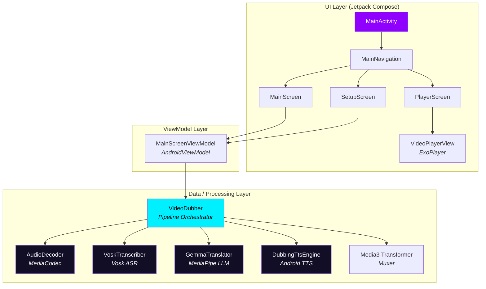
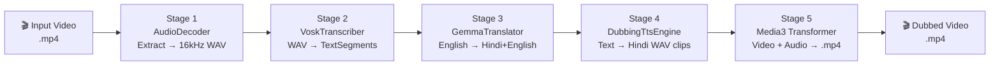

# Nua — Deep Technical Analysis

## Executive Summary

Nua is an Android application designed for on-device video lecture translation and dubbing. Its core use case: take a lecture video in English and produce a dubbed version in Hindi, preserving scientific terminology in English while translating explanatory language — mirroring the natural bilingual teaching style found in Indian classrooms.

The app has a well-structured 5-stage pipeline and a clean Jetpack Compose UI. However, **the project cannot currently produce an APK** due to a critical build configuration defect, and several data-layer components have correctness and robustness issues that will cause runtime failures.

---

## 1. Architecture Overview



### Layers

| Layer | Purpose | Key Files |
|---|---|---|
| **UI** | Compose screens, navigation, theming | [MainActivity.kt](file:///Users/lolet/Downloads/Nua/app/src/main/java/com/example/nua/MainActivity.kt), [Navigation.kt](file:///Users/lolet/Downloads/Nua/app/src/main/java/com/example/nua/Navigation.kt), [MainScreen.kt](file:///Users/lolet/Downloads/Nua/app/src/main/java/com/example/nua/ui/main/MainScreen.kt), [SetupScreen.kt](file:///Users/lolet/Downloads/Nua/app/src/main/java/com/example/nua/ui/setup/SetupScreen.kt), [PlayerScreen.kt](file:///Users/lolet/Downloads/Nua/app/src/main/java/com/example/nua/ui/player/PlayerScreen.kt) |
| **ViewModel** | State management, coordination | [MainScreenViewModel.kt](file:///Users/lolet/Downloads/Nua/app/src/main/java/com/example/nua/ui/main/MainScreenViewModel.kt) |
| **Data** | Audio, ASR, LLM, TTS, Muxing | [AudioDecoder.kt](file:///Users/lolet/Downloads/Nua/app/src/main/java/com/example/nua/data/media/AudioDecoder.kt), [VoskTranscriber.kt](file:///Users/lolet/Downloads/Nua/app/src/main/java/com/example/nua/data/asr/VoskTranscriber.kt), [GemmaTranslator.kt](file:///Users/lolet/Downloads/Nua/app/src/main/java/com/example/nua/data/llm/GemmaTranslator.kt), [DubbingTtsEngine.kt](file:///Users/lolet/Downloads/Nua/app/src/main/java/com/example/nua/data/tts/DubbingTtsEngine.kt), [VideoDubber.kt](file:///Users/lolet/Downloads/Nua/app/src/main/java/com/example/nua/data/media/VideoDubber.kt) |

---

## 2. Build System Analysis

### 2.1 Toolchain

| Component | Version | Notes |
|---|---|---|
| Gradle | 9.1.0 | Latest stable |
| AGP | 9.0.1 | Latest stable |
| Kotlin | 2.3.20 | Bleeding-edge |
| Compose BOM | 2026.03.01 | Latest |
| JDK (host) | 18 | ⚠️ Oracle JDK 18; project targets JVM 17 toolchain |
| compileSdk | 36 | Android 16 |
| minSdk | 24 | Android 7.0 |
| Navigation | Navigation3 1.0.1 | Brand-new (type-safe) |

### 2.2 🚨 Critical Root-Cause: Missing `kotlin-android` Plugin

> [!CAUTION]
> **The `org.jetbrains.kotlin.android` plugin is NOT declared anywhere in the project.** This is the single root cause of the build producing no APK.

#### Evidence chain

The [libs.versions.toml](file:///Users/lolet/Downloads/Nua/gradle/libs.versions.toml#L54-L57) `[plugins]` section declares only:

```toml
[plugins]
android-application = { id = "com.android.application", version.ref = "androidGradlePlugin" }
compose-compiler    = { id = "org.jetbrains.kotlin.plugin.compose", version.ref = "kotlin" }
kotlin-serialization = { id = "org.jetbrains.kotlin.plugin.serialization", version.ref = "kotlin" }
```

**`org.jetbrains.kotlin.android` is absent.** Without it:

1. **No Kotlin compilation tasks** are registered (`compileDebugKotlin` never appears in the task graph)
2. **No Java compilation tasks** either (because all source files are `.kt`, Gradle sees zero Java sources)
3. **No dexing** occurs (no `.class` files → no dex input)
4. **All packaging tasks report `has 0 actions`** and are `SKIPPED`
5. The build finishes with `BUILD SUCCESSFUL` — but produces **zero output**

This was confirmed by `--info`-level Gradle logs showing every single `:app:*` task reports:
```
Task :app:packageDebug has 0 actions
```

#### Why earlier Gradle daemon builds appeared to work

Earlier builds (using the daemon with configuration cache) showed `compileDebugKotlin` in the task graph. This is because the daemon was reusing a stale configuration from a prior state of the project (before `build.gradle.kts` was modified to remove the `jna` dependency). Once `--no-daemon` or `clean` builds forced a fresh configuration, the missing plugin became apparent.

#### Fix

Add to [libs.versions.toml](file:///Users/lolet/Downloads/Nua/gradle/libs.versions.toml):
```toml
kotlin-android = { id = "org.jetbrains.kotlin.android", version.ref = "kotlin" }
```

Add to [build.gradle.kts](file:///Users/lolet/Downloads/Nua/build.gradle.kts) (root):
```kotlin
alias(libs.plugins.kotlin.android) apply false
```

Add to [app/build.gradle.kts](file:///Users/lolet/Downloads/Nua/app/build.gradle.kts) (line 2):
```kotlin
alias(libs.plugins.kotlin.android)
```

### 2.3 JDK Compatibility

The host JDK is **Oracle JDK 18**, but the project declares `jvmToolchain(17)` in [app/build.gradle.kts](file:///Users/lolet/Downloads/Nua/app/build.gradle.kts#L42-L44). Gradle will use the Foojay resolver (declared in [settings.gradle.kts](file:///Users/lolet/Downloads/Nua/settings.gradle.kts#L28-L30)) to auto-provision a JDK 17 for compilation. This _should_ work, but if it can't download the toolchain, compilation will fail or silently fall back to JDK 18. The `sourceCompatibility` and `targetCompatibility` are correctly set to `VERSION_17`.

### 2.4 Configuration Cache

`org.gradle.configuration-cache=true` is enabled in [gradle.properties](file:///Users/lolet/Downloads/Nua/gradle.properties#L15). This is the recommended mode for Gradle 9, but it was a significant red herring during debugging — stale cache entries masked the missing plugin.

---

## 3. Pipeline Technical Walkthrough

The dubbing pipeline in [VideoDubber.dubVideo()](file:///Users/lolet/Downloads/Nua/app/src/main/java/com/example/nua/data/media/VideoDubber.kt#L48-L188) executes 5 sequential stages:



### Stage 1: Audio Extraction ([AudioDecoder](file:///Users/lolet/Downloads/Nua/app/src/main/java/com/example/nua/data/media/AudioDecoder.kt))

- Uses Android `MediaExtractor` + `MediaCodec` to decode the audio track
- Resamples to 16kHz mono 16-bit PCM using linear interpolation
- Writes a standard 44-byte RIFF WAV header
- **Memory concern**: Accumulates ALL decoded PCM shorts into an `ArrayList<Short>` in memory (line 64). For a 1-hour lecture at 44.1kHz stereo, this is ~635M shorts (~1.2GB heap). **This will OOM on real devices.**
- Stereo→mono downmix is correct (average of L+R channels)

### Stage 2: Speech-to-Text ([VoskTranscriber](file:///Users/lolet/Downloads/Nua/app/src/main/java/com/example/nua/data/asr/VoskTranscriber.kt))

- Downloads `vosk-model-small-en-us-0.15` (~40MB zip) from alphacephei.com
- Unzips and initializes with `Model(path)` / `Recognizer(model, 16000f)`
- Feeds 4KB PCM chunks; collects word-level timestamps via `setWords(true)`
- Segments by: silence gap > 0.8s, duration > 7s, or word count > 14
- **Issue**: When `mockMode` is true, `transcribeWav()` is still called but runs on an uninitialized model (returns empty segments). The pipeline then correctly logs "No speech segments detected" but continues to Stage 3 with zero segments, resulting in a dubbed video that is just the original video with a silent audio track — not useful for testing.

### Stage 3: Translation ([GemmaTranslator](file:///Users/lolet/Downloads/Nua/app/src/main/java/com/example/nua/data/llm/GemmaTranslator.kt))

- Real mode: Uses MediaPipe `LlmInference` with Gemma 2B INT4 model (~1.2GB)
  - Attempts GPU backend first, falls back to CPU
  - Max tokens: 128 (reasonable for sentence-level translation)
  - Prompt is well-crafted for the code-mixed translation style
- Mock mode: Rule-based Hinglish mapping with pattern matching for common lecture phrases
  - Includes a sensible noun-preservation set and verb/connector translation table
  - **Issue**: The mock translator's `importantNouns` set is small and hardcoded; unexpected inputs produce garbled output

### Stage 4: Text-to-Speech ([DubbingTtsEngine](file:///Users/lolet/Downloads/Nua/app/src/main/java/com/example/nua/data/tts/DubbingTtsEngine.kt))

- Uses Android's built-in `TextToSpeech` with `Locale("hi", "IN")`
- Clever approach: synthesizes at 1.0x speed, measures duration, then re-synthesizes at adjusted speed to fit the segment's time window (capped at 2.0x)
- `synthesizeToFile()` with `CountDownLatch` for synchronous blocking
- **Issue**: The 5-second init timeout (`initLatch.await(5, TimeUnit.SECONDS)`) may be too short on slower devices where TTS engine initialization involves downloading language packs
- **Issue**: Hindi TTS quality varies wildly across Android devices/OEMs. Some devices may not have Hindi TTS data installed at all.

### Stage 5: Video Muxing ([VideoDubber.mergeVideoAndAudio()](file:///Users/lolet/Downloads/Nua/app/src/main/java/com/example/nua/data/media/VideoDubber.kt#L327-L421))

- Uses Media3 `Transformer` API with `Composition` builder
- Video sequence has `setRemoveAudio(true)` to strip original track
- Audio sequence uses the assembled dubbed WAV
- Progress polling via `Handler.postDelayed(runnable, 300ms)`
- **Issue**: `Transformer.start()` must be called on the main thread (correctly done via `mainHandler.post`), but the `latch.await()` blocks the calling coroutine thread indefinitely with no timeout. If Transformer silently fails without calling either callback, the pipeline hangs forever.

---

## 4. Dependency Audit

| Dependency | Version | Status | Notes |
|---|---|---|---|
| `com.android.application` | 9.0.1 | ✅ Latest | |
| `org.jetbrains.kotlin.android` | — | 🚨 **MISSING** | Root cause of build failure |
| `org.jetbrains.kotlin.plugin.compose` | 2.3.20 | ✅ | |
| `org.jetbrains.kotlin.plugin.serialization` | 2.3.20 | ✅ | |
| Compose BOM | 2026.03.01 | ✅ | |
| Navigation3 | 1.0.1 | ⚠️ Very new API | May have breaking changes |
| MediaPipe GenAI | 0.10.14 | ✅ | |
| Vosk Android | 0.3.75 | ⚠️ | JNA transitive dependency caused duplicate class errors (mitigated by removing explicit `jna`) |
| Media3 | 1.3.1 | ✅ | |
| OkHttp | 4.12.0 | ✅ | |
| JNA | 5.13.0 | ⚠️ Declared but unused | Listed in `[libraries]` but no longer referenced in `dependencies {}` (correct) |

### Repository Configuration

The Google Maven repository in [settings.gradle.kts](file:///Users/lolet/Downloads/Nua/settings.gradle.kts#L14-L25) filters by `includeGroupByRegex` patterns:
- `androidx.*` ✅
- `com.android.*` ✅
- `com.google.*` ✅

**Missing**: `com.alphacephei` (Vosk) and `net.java.dev.jna` (JNA) are NOT matched by these patterns. They must be resolved from `mavenCentral()`, which IS included. This is fine, but if `mavenCentral()` were removed, Vosk would fail to resolve.

---

## 5. UI & Navigation Analysis

### Navigation Architecture
- Uses the brand-new **Navigation3** (`androidx.navigation3`) with type-safe `NavKey` data classes
- Three routes: [Main](file:///Users/lolet/Downloads/Nua/app/src/main/java/com/example/nua/NavigationKeys.kt#L6) (home), [Setup](file:///Users/lolet/Downloads/Nua/app/src/main/java/com/example/nua/NavigationKeys.kt#L7) (AI config), [Player](file:///Users/lolet/Downloads/Nua/app/src/main/java/com/example/nua/NavigationKeys.kt#L8) (video playback)
- `@Serializable` keys use Kotlin Serialization (hence the serialization plugin)

### Theme
- Dark-first design with neon color palette: Purple `#8F00FF`, Cyan `#00F0FF`, Pink `#FF007F`
- Always-dark mode (`darkTheme = true`) in [Theme.kt](file:///Users/lolet/Downloads/Nua/app/src/main/java/com/example/nua/theme/Theme.kt#L31)
- Light color scheme defined but unused

### VideoPlayerView
- Uses `AndroidView` interop for ExoPlayer's `PlayerView`
- **Issue**: `DisposableEffect` wraps `AndroidView` as its key, which is a `@Composable` invocation — this is incorrect usage. `DisposableEffect` keys should be stable values, not Composable function calls. The player may not be properly released on configuration changes.

---

## 6. All Issues — Prioritized

### 🔴 P0 — Build-Breaking

| # | Issue | Location | Impact |
|---|---|---|---|
| 1 | **Missing `kotlin-android` plugin** | [libs.versions.toml](file:///Users/lolet/Downloads/Nua/gradle/libs.versions.toml#L54-L57), [build.gradle.kts](file:///Users/lolet/Downloads/Nua/build.gradle.kts), [app/build.gradle.kts](file:///Users/lolet/Downloads/Nua/app/build.gradle.kts#L1-L5) | No APK is generated. All tasks skip silently. |

### 🟠 P1 — Runtime Crash / OOM

| # | Issue | Location | Impact |
|---|---|---|---|
| 2 | **AudioDecoder loads entire decoded audio into memory** | [AudioDecoder.kt:64](file:///Users/lolet/Downloads/Nua/app/src/main/java/com/example/nua/data/media/AudioDecoder.kt#L64) | OOM for videos > 15min on typical Android devices |
| 3 | **VideoDubber.mergeVideoAndAudio() latch has no timeout** | [VideoDubber.kt:410](file:///Users/lolet/Downloads/Nua/app/src/main/java/com/example/nua/data/media/VideoDubber.kt#L410) | App freezes permanently if Transformer fails silently |
| 4 | **VideoPlayerView DisposableEffect misuse** | [VideoPlayerView.kt:37-55](file:///Users/lolet/Downloads/Nua/app/src/main/java/com/example/nua/ui/components/VideoPlayerView.kt#L37-L55) | ExoPlayer may not be released on navigation, leaking memory |

### 🟡 P2 — Functional Defects

| # | Issue | Location | Impact |
|---|---|---|---|
| 5 | **Mock mode calls VoskTranscriber but model isn't available** | [VideoDubber.kt:81-88](file:///Users/lolet/Downloads/Nua/app/src/main/java/com/example/nua/data/media/VideoDubber.kt#L81-L88) | Mock mode produces silent video with no dubbed audio |
| 6 | **VoskTranscriber model dir detection fragile** | [VoskTranscriber.kt:38-45](file:///Users/lolet/Downloads/Nua/app/src/main/java/com/example/nua/data/asr/VoskTranscriber.kt#L38-L45) | Depends on nested directory structure; model upgrades could break detection |
| 7 | **DubbingTtsEngine init timeout too short (5s)** | [DubbingTtsEngine.kt:50](file:///Users/lolet/Downloads/Nua/app/src/main/java/com/example/nua/data/tts/DubbingTtsEngine.kt#L50) | TTS fails on first use on slower devices |
| 8 | **No Hindi TTS availability check** | [DubbingTtsEngine.kt:28-45](file:///Users/lolet/Downloads/Nua/app/src/main/java/com/example/nua/data/tts/DubbingTtsEngine.kt#L28-L45) | Silent failure if device has no Hindi voice data |
| 9 | **Audio mixing overwrites rather than blends** | [VideoDubber.kt:230-254](file:///Users/lolet/Downloads/Nua/app/src/main/java/com/example/nua/data/media/VideoDubber.kt#L230-L254) | If TTS segments overlap in time, later segments overwrite earlier ones |
| 10 | **Vosk `Recognizer.close()` not in official API** | [VoskTranscriber.kt:220](file:///Users/lolet/Downloads/Nua/app/src/main/java/com/example/nua/data/asr/VoskTranscriber.kt#L220) | May cause compilation error depending on Vosk version |
| 11 | **`startDubbingLocalUri` resets `_isProcessing` mid-pipeline** | [MainScreenViewModel.kt:175](file:///Users/lolet/Downloads/Nua/app/src/main/java/com/example/nua/ui/main/MainScreenViewModel.kt#L175) | Race condition: user could trigger another operation during handoff |

### 🟢 P3 — Code Quality / Polish

| # | Issue | Location | Impact |
|---|---|---|---|
| 12 | **`DataRepository` is unused boilerplate** | [DataRepository.kt](file:///Users/lolet/Downloads/Nua/app/src/main/java/com/example/nua/data/DataRepository.kt) | Dead code from template |
| 13 | **Duplicate WAV header writing code** | [AudioDecoder.kt:237-303](file:///Users/lolet/Downloads/Nua/app/src/main/java/com/example/nua/data/media/AudioDecoder.kt#L237-L303) vs [VideoDubber.kt:256-322](file:///Users/lolet/Downloads/Nua/app/src/main/java/com/example/nua/data/media/VideoDubber.kt#L256-L322) | DRY violation; extract to shared utility |
| 14 | **`FileOutputStream` import used in `VideoDubber`** but uses `java.io.FileOutputStream` | [VideoDubber.kt:19](file:///Users/lolet/Downloads/Nua/app/src/main/java/com/example/nua/data/media/VideoDubber.kt#L19) and [line 209](file:///Users/lolet/Downloads/Nua/app/src/main/java/com/example/nua/data/media/VideoDubber.kt#L209) | Import present but `FileOutputStream` used inline — cosmetic |
| 15 | **No cancellation support** | [MainScreenViewModel.kt](file:///Users/lolet/Downloads/Nua/app/src/main/java/com/example/nua/ui/main/MainScreenViewModel.kt) | User cannot cancel a running dubbing operation |
| 16 | **No target language selection UI** | [MainScreen.kt](file:///Users/lolet/Downloads/Nua/app/src/main/java/com/example/nua/ui/main/MainScreen.kt) | Hindi is hardcoded; stated goal is multi-language |

---

## 7. Security & Privacy

- ✅ `INTERNET` permission correctly declared for Vosk model download and URL video fetch
- ✅ Media permissions appropriately scoped (`READ_EXTERNAL_STORAGE` maxSdk=32, `READ_MEDIA_VIDEO` for 33+)
- ✅ All processing is on-device (when not in mock mode)
- ⚠️ OkHttp video downloads have no certificate pinning or HTTPS enforcement
- ⚠️ No input validation on user-provided URLs (potential SSRF vector)

---

## 8. Performance Considerations

| Area | Current | Recommendation |
|---|---|---|
| Audio decode | In-memory accumulation | Stream-and-resample in chunks |
| Vosk inference | Single-threaded, 4KB buffer | Increase buffer to 16KB+ |
| Gemma inference | Sequential segment-by-segment | Batch prompting or async pipeline |
| TTS synthesis | Two-pass (measure + re-synthesize) | Accept first pass if within 10% tolerance |
| Video muxing | Media3 Transformer | ✅ Good choice, hardware-accelerated |

---

## 9. Remediation Roadmap

### Phase 1: Get It Building (30 min)
1. Add `kotlin-android` plugin to version catalog, root build file, and app build file
2. Run `./gradlew clean assembleDebug` and verify APK generation
3. Install on emulator/device and verify basic launch

### Phase 2: Fix Runtime Crashes (2-4 hours)
4. Fix AudioDecoder memory issue (stream-based resampling)
5. Add timeout to Transformer latch
6. Fix VideoPlayerView DisposableEffect
7. Fix mock mode to generate test transcript segments
8. Add Hindi TTS availability check with user-facing error

### Phase 3: Robustness & Polish (1-2 days)
9. Add processing cancellation
10. Extract shared WAV utilities
11. Remove dead code (`DataRepository`)
12. Add target language selector
13. Add URL validation
14. Add proper error recovery and retry logic

---

> [!IMPORTANT]
> **Immediate next step**: Fix the missing `kotlin-android` plugin (Issue #1). This is a 3-line change across 3 files that unblocks the entire project. Should I proceed with this fix?
