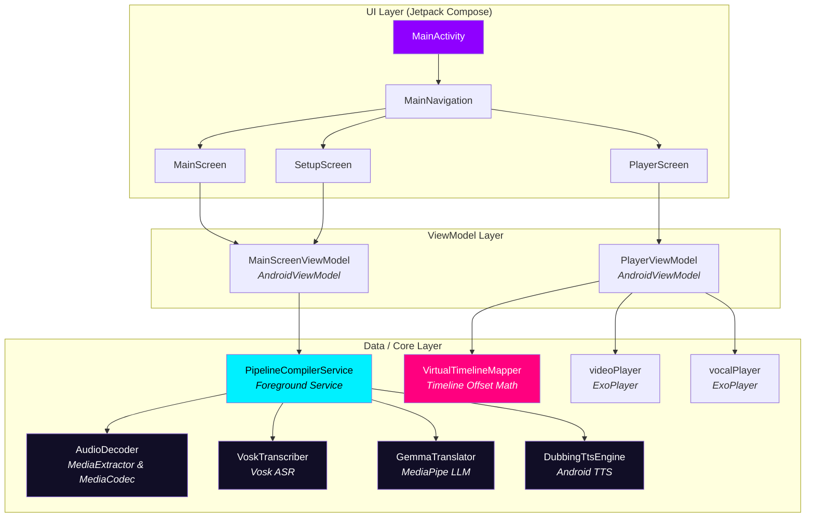

# Nua — Deep Technical Analysis

## Executive Summary

Nua is an Android application designed for on-device video lecture translation and dubbing. Its core use case: take a lecture video in English and produce a dubbed version in Hindi, preserving scientific terminology in English while translating explanatory language — mirroring the natural bilingual teaching style found in Indian classrooms.

The app is built around a highly innovative **dynamic freeze-frame dubbing architecture**. Rather than running expensive, battery-draining video re-encoding/muxing on-device, Nua creates a portable offline package containing the raw video, dubbed voice assets, and a synchronization manifest. During playback, a custom dual-player synchronization layer maps a virtual lecture timeline to the physical video, ducking original audio and freezing the video track on-demand when the translated Hindi audio requires more time than the original English phrasing.

While this architecture is elegant and efficient, **the project cannot currently compile an APK** due to a critical build configuration defect. Additionally, several bugs in the data and player synchronization layers will cause runtime failures or silent playback gaps.

---

## 1. Architecture Overview



### Components

| Layer | Component / File | Responsibility |
|---|---|---|
| **UI** | [MainActivity.kt](file:///Users/lolet/Downloads/Nua/app/src/main/java/com/example/nua/MainActivity.kt)<br/>[Navigation.kt](file:///Users/lolet/Downloads/Nua/app/src/main/java/com/example/nua/Navigation.kt)<br/>[PlayerScreen.kt](file:///Users/lolet/Downloads/Nua/app/src/main/java/com/example/nua/ui/player/PlayerScreen.kt) | Implements Jetpack Compose navigation (using AndroidX Navigation3) and UI screens. Renders ExoPlayer output via `AndroidView` interop. |
| **ViewModel** | [MainScreenViewModel.kt](file:///Users/lolet/Downloads/Nua/app/src/main/java/com/example/nua/ui/main/MainScreenViewModel.kt)<br/>[PlayerViewModel.kt](file:///Users/lolet/Downloads/Nua/app/src/main/java/com/example/nua/ui/player/PlayerViewModel.kt) | `MainScreenViewModel` triggers compilation and downloads models. `PlayerViewModel` coordinates the dual-ExoPlayer sync loop. |
| **Core Compiler** | [PipelineCompilerService.kt](file:///Users/lolet/Downloads/Nua/app/src/main/java/com/example/nua/data/media/PipelineCompilerService.kt) | Foreground Android service orchestrating the 5-stage compilation pipeline. |
| **Audio Processing** | [AudioDecoder.kt](file:///Users/lolet/Downloads/Nua/app/src/main/java/com/example/nua/data/media/AudioDecoder.kt) | Decodes the source video's audio track, downmixes to mono, and resamples to 16kHz PCM WAV on-the-fly using linear interpolation. |
| **Speech-to-Text** | [VoskTranscriber.kt](file:///Users/lolet/Downloads/Nua/app/src/main/java/com/example/nua/data/asr/VoskTranscriber.kt) | Offline English ASR using a downloaded Vosk-small model. Extracts word-level timestamps. |
| **Translation** | [GemmaTranslator.kt](file:///Users/lolet/Downloads/Nua/app/src/main/java/com/example/nua/data/llm/GemmaTranslator.kt) | Translates English segments to code-mixed Hinglish using on-device Gemma 2B INT4 via MediaPipe GenAI. Limits word count to match target durations. |
| **Voice Synthesis** | [DubbingTtsEngine.kt](file:///Users/lolet/Downloads/Nua/app/src/main/java/com/example/nua/data/tts/DubbingTtsEngine.kt) | Synthesizes Hindi voice clips using Android's native TTS. Speeds up speech rate dynamically (up to 2.0x) if the translation runs long. |
| **Playback Sync** | [VirtualTimelineMapper.kt](file:///Users/lolet/Downloads/Nua/app/src/main/java/com/example/nua/data/media/VirtualTimelineMapper.kt) | Calculates time offsets and maps playhead state between the physical video (which may pause/freeze) and the virtual lecture timeline. |

---

## 2. Build System Analysis

### 2.1 Toolchain

| Component | Version | Notes |
|---|---|---|
| Gradle | 9.1.0 | Stable |
| AGP | 9.0.1 | Stable |
| Kotlin | 2.3.20 | Stable compiler |
| JDK | 17 / 18 | Target compatibility set to JVM 17; compile options use Java 17 toolchain. |
| compileSdk | 36 | Android 16 |
| minSdk | 24 | Android 7.0 (Nougat) |

### 2.2 🚨 Critical Root-Cause: Missing `kotlin-android` Plugin

The project compiles with Kotlin and targets Android, but the Kotlin-Android plugin `org.jetbrains.kotlin.android` is **completely missing** from the build files.

1. **Gradle Catalog** ([libs.versions.toml](file:///Users/lolet/Downloads/Nua/gradle/libs.versions.toml#L56-L59)) lacks any entry for `kotlin-android`. It only defines:
   ```toml
   [plugins]
   android-application = { id = "com.android.application", version.ref = "androidGradlePlugin" }
   compose-compiler = { id = "org.jetbrains.kotlin.plugin.compose", version.ref = "kotlin" }
   kotlin-serialization = { id = "org.jetbrains.kotlin.plugin.serialization", version.ref = "kotlin" }
   ```
2. **Root Configuration** ([build.gradle.kts](file:///Users/lolet/Downloads/Nua/build.gradle.kts)) does not register it.
3. **Module Configuration** ([app/build.gradle.kts](file:///Users/lolet/Downloads/Nua/app/build.gradle.kts#L1-L5)) does not apply it.

**Impact**: Because the Gradle Kotlin-Android compiler task isn't registered, Kotlin files are not compiled. No `.class` or `.dex` files are output, and the packaging tasks are skipped. The build finishes as "SUCCESSFUL" but produces **zero APK files**.

---

## 3. Pipeline Core Analysis

The dubbing and compilation pipeline runs in [PipelineCompilerService.kt](file:///Users/lolet/Downloads/Nua/app/src/main/java/com/example/nua/data/media/PipelineCompilerService.kt#L78-L224):

```
[🎬 Input Video]
       │
       ▼
1. Audio Extraction  ──► Decodes audio, downmixes to mono, and resamples to 16kHz
       │                 (Uses AudioDecoder.kt with live stream-based writing)
       ▼
2. Transcription     ──► Runs offline Vosk ASR to output text segments with word timestamps
       │
       ▼
3. LLM Translation   ──► On-device Gemma 2B via MediaPipe translates English to Hinglish
       │                 (Limits translated words based on segment duration)
       ▼
4. TTS Generation    ──► DubbingTtsEngine runs Android Text-to-Speech with a Hindi locale
       │                 (Saves voice segments as separate WAV files in vocal_chunks/)
       ▼
5. Package Manifest  ──► Writes manifest.json containing segment timestamps & file assets
```

### Key Technical Deep Dives:

*   **Memory-Efficient Audio Resampling**: Unlike naive encoders that load whole audio tracks into RAM (which causes OOM crashes on long files), `AudioDecoder.kt` resamples stream chunks on-the-fly, buffering writes into a small 16KB window before outputting to the filesystem.
*   **Speed-Adaptive Voice Generation**: `DubbingTtsEngine.kt` runs a two-pass synthesis. It first synthesizes text at normal speed, measures the output WAV file duration, and if it exceeds the target English segment duration, re-synthesizes with an adjusted speed rate (capped at 2.0x for intelligibility).
*   **Virtual Timeline Playback Synchronization**:
    The playback screen maps the timelines in real-time. If Hindi speech is longer than the English source, `VirtualTimelineMapper` flags `shouldFreeze = true`. In `PlayerViewModel`, when `shouldFreeze` is true, the `videoPlayer` ExoPlayer pauses and locks to `originalEndMs`, while the `vocalPlayer` ExoPlayer finishes playing the Hindi audio chunk. Once the vocal player completes, the video unfreezes and resumes playing.

---

## 4. Prioritized Issue Backlog

### 🔴 P0 — Build-Breaking

| # | Issue | Location | Impact |
|---|---|---|---|
| 1 | **Missing `kotlin-android` plugin** | [libs.versions.toml](file:///Users/lolet/Downloads/Nua/gradle/libs.versions.toml#L56-L59), [build.gradle.kts](file:///Users/lolet/Downloads/Nua/build.gradle.kts), [app/build.gradle.kts](file:///Users/lolet/Downloads/Nua/app/build.gradle.kts#L1-L5) | The build compiles zero Kotlin files, producing no APK. |

### 🟠 P1 — Critical Runtime Bugs

| # | Issue | Location | Impact |
|---|---|---|---|
| 2 | **Mock Mode failure with missing Vosk model** | [PipelineCompilerService.kt:126](file:///Users/lolet/Downloads/Nua/app/src/main/java/com/example/nua/data/media/PipelineCompilerService.kt#L126)<br/>[VoskTranscriber.kt:173](file:///Users/lolet/Downloads/Nua/app/src/main/java/com/example/nua/data/asr/VoskTranscriber.kt#L173) | Even in mock mode, `VoskTranscriber.transcribeWav` is executed. If the ASR model isn't downloaded, transcription returns empty, generating a dubbed package with zero segments (silencing the output). Mock mode should bypass ASR entirely. |
| 3 | **Stuttering due to frequent Player Sync loop seeks** | [PlayerViewModel.kt:249-252](file:///Users/lolet/Downloads/Nua/app/src/main/java/com/example/nua/ui/player/PlayerViewModel.kt#L249-L252) | Checked at 30ms intervals, if vocal player drift is >150ms, it executes a `seekTo()`. This can trigger recurrent audio stuttering under mild system lag. |
| 4 | **No check for installed Hindi TTS data** | [DubbingTtsEngine.kt:29-45](file:///Users/lolet/Downloads/Nua/app/src/main/java/com/example/nua/data/tts/DubbingTtsEngine.kt#L29-L45) | If a device does not have Hindi language packs installed, the TTS engine fails silently or defaults to English, generating incorrect language output. |
| 5 | **Hardcoded Zip entries count in unzipping progress** | [VoskTranscriber.kt:139](file:///Users/lolet/Downloads/Nua/app/src/main/java/com/example/nua/data/asr/VoskTranscriber.kt#L139) | Assumes exactly 100 entries for Vosk zip file. If the model archive updates or has a different layout, progress calculations fail. |

### 🟡 P2 — Functional Defects & Cleanup

| # | Issue | Location | Impact |
|---|---|---|---|
| 6 | **Dead Code: `VideoPlayerView.kt`** | [VideoPlayerView.kt](file:///Users/lolet/Downloads/Nua/app/src/main/java/com/example/nua/ui/components/VideoPlayerView.kt) | A custom video component that contains a misuse of Composable functions inside a `DisposableEffect` key. However, this component is completely unused because `PlayerScreen` embeds ExoPlayer directly. |
| 7 | **Lack of cancellation support in compiler service** | [PipelineCompilerService.kt](file:///Users/lolet/Downloads/Nua/app/src/main/java/com/example/nua/data/media/PipelineCompilerService.kt) | Once started, a compilation cannot be cancelled from the UI. |

---

## 5. Security & Privacy Audit

*   **Local-First Processing**: In real-mode, all steps (ASR via Vosk, translation via Gemma, and voice generation via TTS) are performed locally on the user's device. No voice or text data is sent to external APIs.
*   **Networking**: OkHttp is used to download the Vosk model zip file (~40MB) and fetch remote test videos. There is no certificate pinning or content validation, making remote video downloads susceptible to typical network interceptions or malformed payloads.

---

## 6. Implementation Remediation Roadmap

### Phase 1: Build Remediation
1. Declare `kotlin-android` in [libs.versions.toml](file:///Users/lolet/Downloads/Nua/gradle/libs.versions.toml) and apply it to [build.gradle.kts](file:///Users/lolet/Downloads/Nua/build.gradle.kts) and [app/build.gradle.kts](file:///Users/lolet/Downloads/Nua/app/build.gradle.kts).
2. Execute `./gradlew assembleDebug` to confirm code compiles and generates the APK package.

### Phase 2: Pipeline & Playback Fixes
3. Modify [PipelineCompilerService.kt](file:///Users/lolet/Downloads/Nua/app/src/main/java/com/example/nua/data/media/PipelineCompilerService.kt) to return mock segments directly when `mockMode = true`, instead of calling the uninitialized `VoskTranscriber`.
4. Refine the drift threshold and seek mechanics in `PlayerViewModel.kt` to avoid recurrent audio stutter.
5. Check TTS engine language availability during initialization and prompt the user to download Hindi voice data if missing.
6. Clean up dead code, including [VideoPlayerView.kt](file:///Users/lolet/Downloads/Nua/app/src/main/java/com/example/nua/ui/components/VideoPlayerView.kt).
